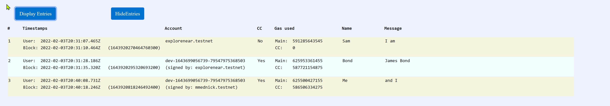

# Exploring NEAR Protocol Smart Contracts

## Overview

I created this project to learn the basics of creating, testing and deploying  a smart contracts using NEAR project blockchain. 

This started out as just trying to figure out how to create a simple contract and grew as I understood more and wanted understand how various things work. 

My exploration covered the following areas

* Two Rust smart contract that were created using the near-sdk-rs
	* defining basic contract structure and methods
	* accessing and using data from the NEAR env
	* implements various testing options:
		* Rust unit tests 
		* Rust simulation tests 
		* jest javascript based tests 
	* A contract that NEAR specific data structures that are optimized for accessing data on the blockchain (i.e  Near "Vector" instead the Rust std "Vec") 
	* Using the NEAR U64/U128 JSON types (that workaround JSON 53 bit limitations)
* the basics of using the JS API (Reference) to interact with smart contracts 
* Integrating  with the NEAR wallet:
	- to 'log in' to acquire the signing key for requests 
	- to approving transfers associated with requests that transfer tokens
	- supports multiple wallet logins/signing keys on a single web page
* cross contract calls between two contracts
	- how to develop tests for contracts with cross contract calls
* how to transfer funds between accounts
* scripts/instructions for deploying, initializing


## Functional Overview
From a functional standpoint, this app is a web page that displays information and allows interation with two smart contracts.

A that provide a *very* basic and limited a set of logging functionality;  they allow a user to log some data (a 'log entry') that is stored by the contract.  Entries can later be read back in the order added. 

Each 'log entry' contains some user specified data (a couple of strings) along with some additional metadata ( e.g.  timestamp, AccountId that added the entry ).  

### Block Diagram


### Key Components 

There are three key components project:
* The **main** contract
* The **proxy** contract
* The Web User Interface


Both contracts are written in Rust using the Near Rust SDK (https://github.com/near/near-sdk-rs )

The web User Interfaces written in javascript and use the NEAR Javascript library  (https://github.com/near/near-api-js)


#### The Main contract
The main contract is the one that does that actual data storage and retrieval of the log entries it support the following methods

| Method       | Description                                                  |
| ------------ | ------------------------------------------------------------ |
| new          | Initializes the log                                          |
| add_entry    | Adds an entry to the log                                     |
| num_entry    | Returns the number of entries that have been added to the log |
| list_entries | provides the full list of all the entries in the log         |
| get_last     | returns only the last entry added to the log                 |
| info         | Returns information about the configuration of the contract  |
| reset_log    | Clears the log                                               |

#### The Proxy Contract

THe proxy contract primary functions is the make cross contact calls the Main contract.

| Method | Description|
|--------|------------|
|new| Initialize the contract which requires AccountId of the account the main logging contract is deployed|
|indirect_add_entry| Calls add_entry on the main contact. |
|indirect_num_entries| Call num_entries on the main contract|
|info|returns the configuration information for the contract (the AccountId of the main contract)|


#### The Web User Interface

HMTL and javascript pages

# Getting Started

Cloning the repo to your local machine.

Identify what account will be used as the Admin account

Install packages

Build the contracts

Run Tests


## Install packages and dependencies.   

    `yarn` 

## Build the contracts

    `yarn build`

## Run Tests

The following will run the unit tests, the Rust Simulation tests and the jest based end-to-end tests in the NEAR shared-test environment.

```
yarn test
```

## Select/Setup Admin Account

Both contracts require initialization with a NEAR account which is considered to be the admin and is allowed to use methods that affect the configuration such as being able to clear the log or for the Proxy contract configure the AccountId of the main contract which it will make the cross contract calls to)

##  Deploy

Contracts are deployed to an account, and each account can only have one contract deployed to it.  
The contract should be deployed to a subaccount or during development to a dev account.
Both methods are described below

### Deploying to Development Accounts

The script 'newdeploydev.sh' is included to deploy and initialize each contracts to two separate development accounts.    The script requires one argument the name of an account which will be the 'admin' for the contracts and will output a file named 'devconfig' which contains bash shell commands to set the necessary environmental variables for of each of the accounts that were created.  

```newdeploydev.sh <admin_acct_id>```

If the admin account set in ADMIN_NAME environmental variable (export ADMIN_NAME=<admin_acct_id>) then the command

```yarn deploy:dev:new``` 

can be used to call the same script.


### Deploying to Specific Named Accounts
The script "deploy.sh" can be used to deploy contracts to specific accounts.  the script requires three parameters the account to deploy the main contract, the account to deploy the proxy contract, and the name of the account to initialize the contracts as the 'admin' account

```
deploy.sh <main_acct_id> <proxy_acct_id> <admin_acct_id>
```

Alternatively the 3 IDs can be provided as environmental variables :
```
export CONTRACT_NAME=<main_acct_id>
export SUBCONTRACT_NAME=<proxy_acct_id>
export ADMIN_NAME=<admin_acct_id>
```

and then simply run as:

```
deploy.sh
```

## Starting the Application Locally

If you have already deployed and initialized the contracts, you start a web local server using parcel which will make the UI web page available  (usual localhost:1234) with the following command

```
yarn restart
```

Alternatively, if you have made some changes that don't impact the on-chain data structures you can rebuild and redeploy the contracts with the start command:

```
yarn start
```

This command will rebuild he contracts and redeploy them to the existing accounts (note that it will redeploy the contracts them even if they haven't changed) and then start the local web server as above.

However if you've made changes to the on chain data structure the new contracts will throw errors as they won't be able to access the existing data properly.  In this case you will need to redeploy the contracts to new accounts and re-initialize them [See section on deploying](#deploy)

## Interacting with the Application

Opening the web pages you will see two column one for the Main contract and one for the Proxy contract. 


The header section shows the accounts which each contract is deployed on along with the current available balance on that account, and the information at initialization.  

- For the Main account that is the admin account.  
- For the Proxy contract, the admin account and the contract where it will proxy requests to 
  (which should be the Main account) 

The web page allows and requires a separate sign in with the NEAR wallet to interact with the contract. Each side has a separate entry for signing in to interact with that particular contract.   

Note that the information that is displayed in the header (e.g. the admin user) is getting that information via a contract method.  Each contract has a 'info' method that provides the currently configured in that contract.  The UI uses a 'view' (read-only) access  to query the contract to get that information.    (View methods don't need to be signed and there for don't require 'log in' to the NEAR wallet to access signing keys) 

### After Sign-in

After sign in, the options to add a log entry are enabled and an simple entry form (A timestamp, Name and Message) is displayed. 


Both contracts have entry forms, but the Proxy version has an additional field allowing Near tokens to be transferred from logged in user to the Main contract.  Transferring is optional.  To not transfer any  tokens leave the amount at 0.  Any amount such as 1,  0.1,  .0001  can be entered either and can represent  NEAR or Million YactoNEAR).

### Viewing Records

#### Last Record 

Once an entry is added to the contract (either), the last record from the log will be displayed in the status window.  This shows the full entry that is logged to the contract in JSON format.

The data in the record is as follows:

```
pub struct LogEntry {
    entry_id:  u64,                  // index of the entry starting from 0
    timestamp: String,            // timestamp as provided by the user
    block_ts: u64,                  // the current block_timestamp as reported by env::block_timestamp
    account: AccountId,         // account which made the request (which could be a user or anothercontract)
    signaccount: AccountId,  // the account tthat signed the request
    name: String,                   // Name -- user provided string
    message: String,              // message -- user provided string
    used_gas: u64,                // used gas as reported by env::gas in this contract
    cc_used_gas: u64,          // when call is made by a another contrct, the amount of gas reported in its env::used_gas
    transfer_amount: u128,  // amount of NEAR transfered (from env::attached_depoist)
 }
```

This view of the the last record uses the get_last method which finds the number of entries and then returns  only the last records


Note on timestamps -- when logging an entry provides a timestamp which  is base on their local machine (e.g. javascript Date() ) and this could vary and can't be considered reliable as comes from the local machine.  As such to ensure that every record is the the contract also logs the current block_timestamp which while may delayed from when the request was made , should be at least consistent and increasing across multiple requests as its maintained and provided by the blockchain.

#### Display Records

At the bottom of the screen there is an option to display all the records.   This interface interacts with get_entries (check name) method which returns ALL the entries in one request.  This is sufficient for this exploration project since the number of entries is small, but for a larger dataset it would be updated to use windowing and only retrieve N records at time, using the similar Vector method as 'get_last' uses to read only the last record. 

    

# References

* [Rust Smart Contract Quick Start](https://docs.near.org/docs/develop/contracts/rust/intro)
* [Rust SDK Book](https://www.near-sdk.io/)

